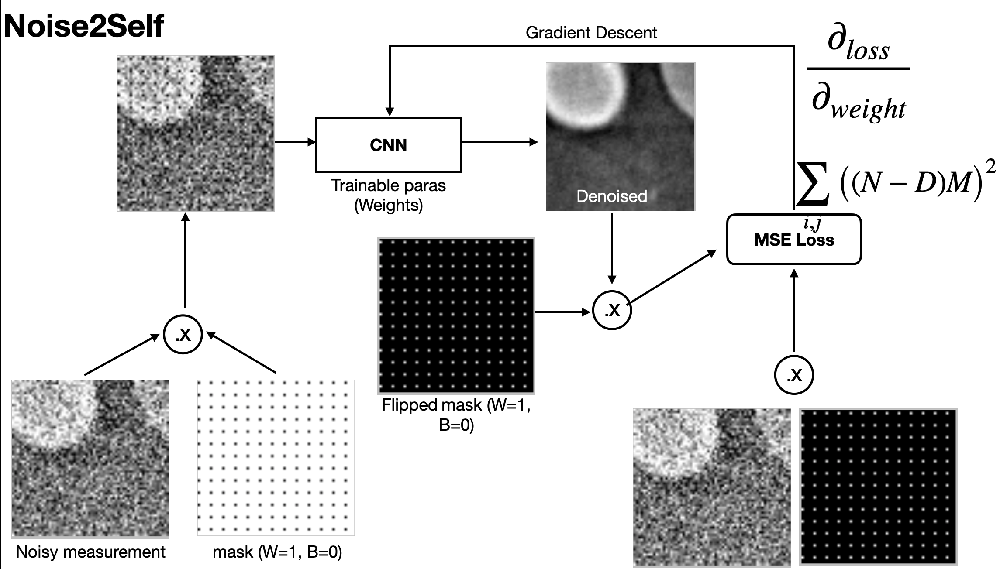

run code with 
./main.py -expName=name-u-want -nvar=variance-of-noise 
- if you only want to use some gpus of given, e.g., 0, 1 an 2, use -gpu=0,1,2. GPU index are based on nvidia-smi, by default it uses all available GPUs
- by default, i only keep the last image for testing, and use all 1 - (n-1) for training
- you can check the results in {$expName}-itrOut, model checkpoints are saved there as well.
- if you want to try your own images. save you 3D array (n, h, w) a h5 file using key 'data'
- the file name is hardcoded so far, please update your filename in data.py[note, there are two lines contain filename]
- you need to make sure that your images pixels have values in range [0, 255], otherwise you need to normalize it 
in data.py file 

